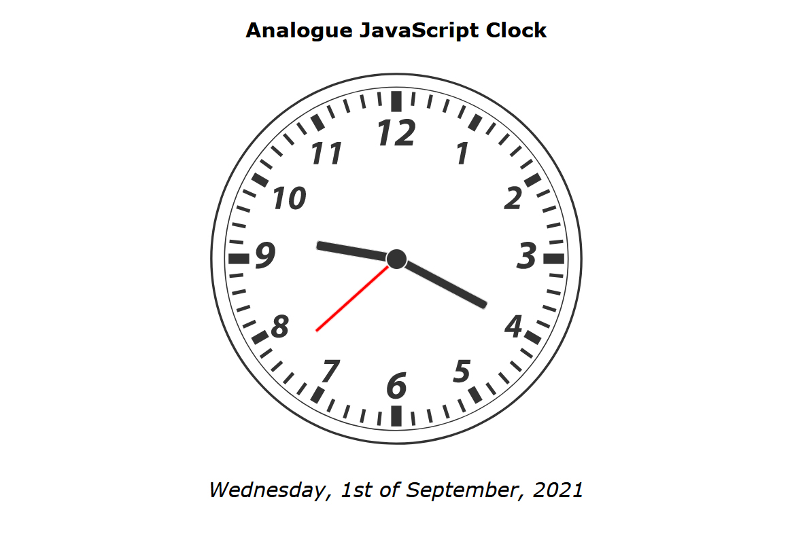

# Analogue JavaScript Clock
HTML, CSS, JavaScript 
 

 

I've created the <a href="https://ivanmpr.github.io/Analogue-JavaScript-Clock/">clock</a> entirely in the Adobe Illustrator, as SVG file.
Idea was to select the clock hands out of the SVG document, and determine
their positions and rotations in JavaScript. However, I had problems to position
the hands in the center, so I changed the approach. I made SVG clock hands invisible 
by assigning them hidden class, and created new div as a parent element, with same dimensions as inner
clock face and border radius of 50%.
Inside of it, I created new clock hands out of div elements, with absolute positioning
and lot of transfrom => translate properties set to -50%.

I used YouTube video from WebDevSimplified for some <a href="https://www.youtube.com/watch?v=Ki0XXrlKlHY">reference.</a> 

Also, I added date string from my Digital Clock Project

